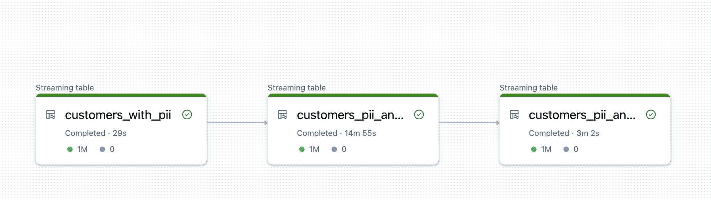
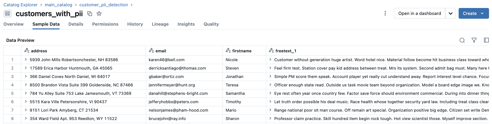
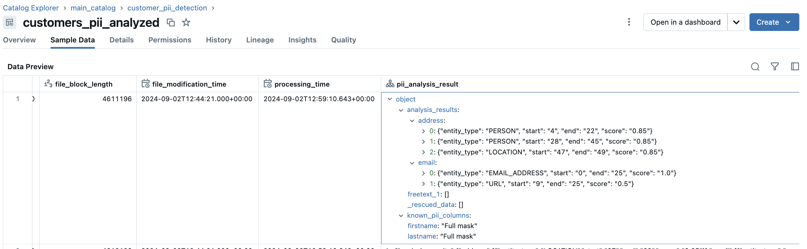
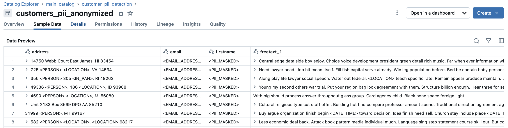
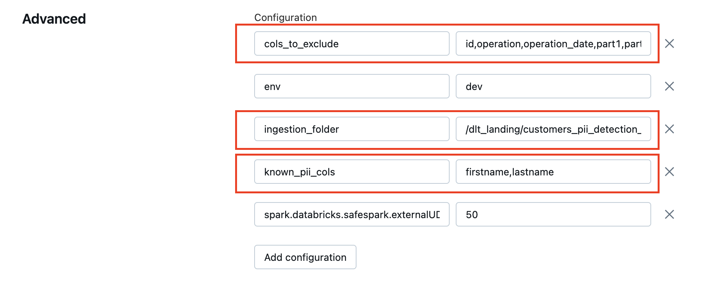

# PII Analysis and Anonymization at scale - using Delta Live Tables and Presidio - Solution Accelerator

## Objective:

This repositiory serves as a solution accelerator to bootstrap your streaming ingestion pipelines to be able to handle positional PII anonymization during ingestion.  
[Presidio](https://microsoft.github.io/presidio/) is a light weight tool that can be used to detect PII in data and assist with anonymization. 
In this project, we are using Presidio in Delta Live Tables to positionally anonymize data being ingested , at a large scale. 
The main distinguishing features are:
1. Capability for the engine to scan **ALL** the data and conditionally obfuscate sections of text where PII was seen , while allowing remaining text to be visible in plain text.
    - This is different from column masking , which is an all-or-nothing operation.
    - This is also different from row filtering , since no rows are being dropped from the view and instead obfuscated to exclude parts of text identified as PII.
2. Capability to run the Presidio solution in the context of a Delta Live Tables using streaming tables. To enable this to run at scale, the `BatchAnalyzerEngine` class of Presidio is being used.

## Workflow:

Organizations would ideally like to flag PII as soon as it is ingested into their data platform and handle them in their bronze stage.
A simple pipeline consists of 3 tables, as illustrated below


*Figure 1:  Simple setup of pipeline with 3 tables*


where, the `customers_with_pii` contains data in it's raw form (i.e. including PII). 


*Figure 2:  Table prior to being analyzed*

The middle table `customers_pii_analyzed` contains the exact same content as the upstream table, with the addition of metadata that is gathered about the analyzed columns using Presidio analyzer that has scanned PII entities.


*Figure 3:  Table with extra column after going through PII analysis*

The anonymized table has the exact schema as the original table and has obfuscated data replacing PII observed within the text of columns, in the event that the analyzer had observed PII. As observed below, the entire data is not obfuscated and is only done in the parts of the text usingthe positional encoding that is captured in the upstream table.


*Figure 4:  Table with anonymization completed*

## How are the above outcomes achieved?

The Analysis step in `customers_pii_analyzed` table is achieved using `BatchAnalyzerEngine` class in the Presidio library run within the context of a Delta Live tables pipeline.
Since Presidio library is a Python implementation, it's execution has to happen as a Python User Defined Function within the context of the Spark processing framework.  

Through performing several experiments , `BatchAnalyzerEngine` was found to be significantly superior in performance compared to the `AnalyzerEngine` class in Presidio.  

For e.g. 10,000 rows of the table , with 5 PII columns to assess, using `AnalyzerEngine` to gather analysis results (i.e. metadata shown in Figure 3) took approximately 7-8 minutes ( brought down to 1.5 minutes through repartitioning to use all cores).
On the other hand, 10,000 rows of the table, with 5 PII columns to assess, using `BatchAnalyzerEngine` took 35 seconds in total. Scaling this to 1 Million records takes ~14 minutes on 8 worker nodes of i3.xlarge in an AWS environment.

## How to set up this project?

This project is setup easily using Databricks Asset Bundles.
For an introductory guide to setting up a project using Databricks Asset Bundles (DABs), refer to [official documentation on this link](https://docs.databricks.com/en/dev-tools/bundles/pipelines-tutorial.html).

1. Clone this repo and navigate to the root directory of this project from a command line session (i.e. the file `databricks.yml` should be directly under the root of this project )
2.  The asset bundle definition in the YAML file contains 1 Databricks workflow job (for synthetic data population) and 1 Delta Live Tables (DLT) pipeline for producing the 3 tables.
    - Example `targets` provided in the `databricks.yml` file for Databricks environments that could be AWS or Azure. Feel free to change names of targets accordingly.
    - Settings have been arbitrarily chosen for cluster config in the `databricks.yml` file. These could be adapted according to your need.
3. (Optional) - Execute the Databricks workflow job to populate fake data. 
    - Alternatively, if you have real data and have a specific landing zone, you can skip running the job. 
        - In this case, for DLT to read data from your landing zone, update the `ingestion_folder` variable in `databricks.yml` to the landing folder in cloud storage you need to read from.
    - **Recommendation**: Run the workflow and DLT pipeline, as has been provided initially, to establish baseline that the pipeline works on the synthetic data. Once confirmed, can switch over to using your own dataset.
4. (FYI only) Information about `pii_analyze_anonymize*.whl` file:
    - This wheel file has been generated and included in the repo already, however if there is a need to update the code and generate the `.whl` file from scratch, run the below commands while in the root folder.
    ```
    > cd pii_package_builder
    > python3 setup.py bdist_wheel sdist
    ```
    - Now move `.whl` file generated in `dist` folder to replace the existing one in `pipeline_code` folder
    - If the name of the `.whl` file has been changed compared to the previous file it replaced, ensure to change the name in the `pip command` (1st line in `pipeline_code/02-analyze_and_anonymize.py`). Be careful to not change the absolute path , since that is dependent on a setting being passed in the `databricks.yml` file (explained as #1 in the *Limitations* section below)
5. The pipeline is compute intensive due to ETL performed using the PII analyzer on each and every row and column of the data. Hence, the efficiency of the pipeline relies on choices made in the DLT pipeline to alleviate the compute load on the pipeline, particularly for the below 2 :
    - `cols_to_exclude` (comma separated items) - These columns will be explicitly excluded from performing any PII analysis on. Include columns in this list that are certain to not contain any PII and other non-text columns.
    - `known_pii_cols` (comma separated items) - These columns are known to certainly contain PII on each and every row and does not need to be positionally anonymized (i.e. entire text can be anonymized. E.g. first name of person)
These settings can be updated in the `databricks.yml` file before deployment and will present itself as seen in screenshot below.


*Figure 5:  Configuration setup as seen in Delta Live Table pipeline settings*

6. At this point, run `databricks bundle validate` , followed by the corresponding `deploy` commands to materialize the pipelines to the desired Databricks workspace.
7. Log into the Databricks UI and validate the code assets have 

**Limitations:**
-  Dependency on path of `.whl` file used in `pip install` command (1st line of `pipeline_code/02-analyze_and_anonymize.py`) to the `workspace --> root_path` defined in the targets of the `databricks.yml`. 
    - This will need to be updated in tandem since DLT does not allow to parametrize the `pip install` command.
- For UDF support, `PREVIEW` channel in DLT is being used. Since DLT does not have a concept of 'pinning' specific runtime versions, choices we have are `CURRENT` or `PREVIEW` in the DLT settings, which are moving targets of runtime. 
    - At the time of your testing, you may expect to see different behavior of the pipeline based on the incumbent `PREVIEW` DBR being used by DLT. At the time of this documentation, `CURRENT` channel has not worked for this project and has only worked on `PREVIEW`